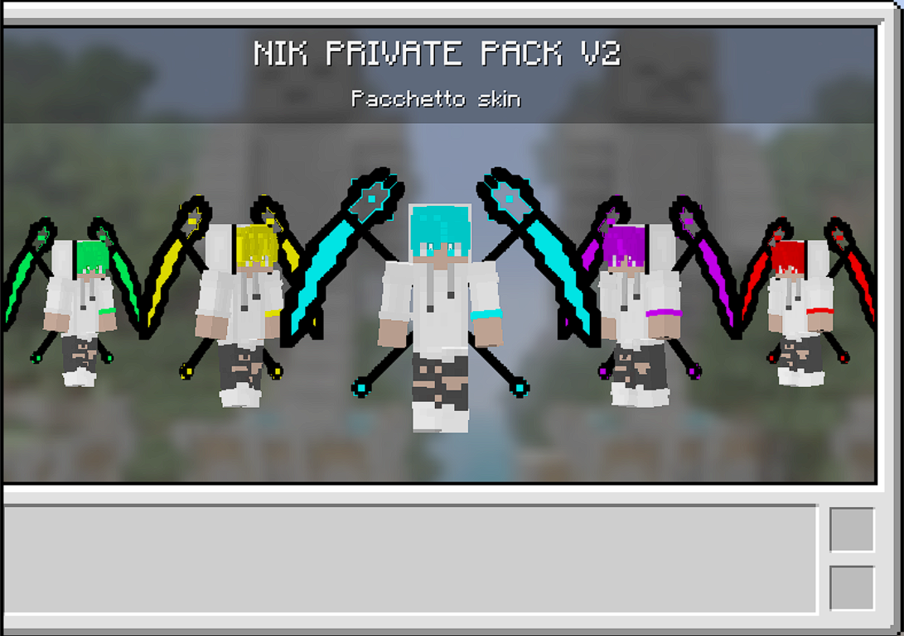

# ✨ JSON Converter for Custom Skins ✨

---

# ⚠ WARNING ⚠

**The creator is NOT responsible for anyone using this tool to steal models or claim them as their own.  
Any abuse can be reported on the Nikstudios Discord server.**

---

## 🚀 Main Features

- 🖥️ User-friendly GUI with multilingual support
- ⏱️ Fast and easy to use
- 🔄 Reverse conversion: .JSON → .CSM or on the contrary
- 🌐 Update notifications directly in the app
- 🌍 Built-in language system

---

## 🖼️ Preview

  
  

---

## 🔧 Requirements

- PCK Studio  
- A `.json` file (created in Blockbench) or a `.csm` file to convert into `.json`

---

## 📦 Installation

1. Download and extract the `.zip` file anywhere you prefer.
2. Make sure `MetroFramework.dll` is in the **same folder** as the `.exe`.
3. Run the `.exe` file — the application should launch immediately!

---
