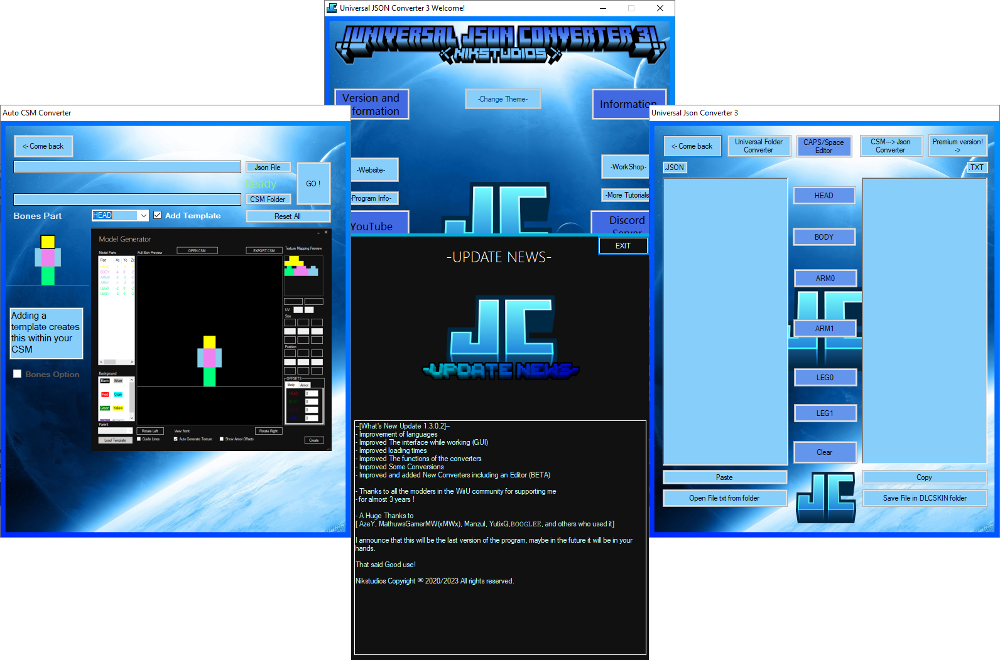
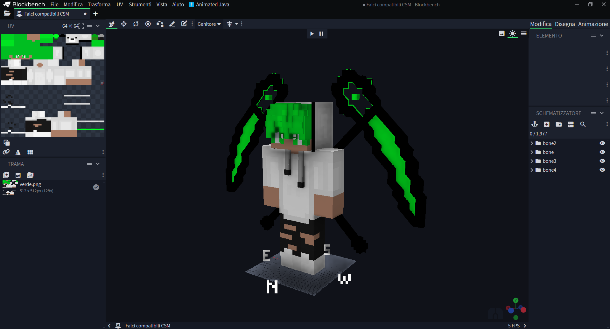

# ✨ Json Converter For Custom Skin ✨

 

---
# ⚠ AVVERTIMENTO ⚠

IL CREATORE NON é RESPONSABILE PER CHI LO USA PER RUBARE MODELLI O PER SPACCIARLI SUOI
PER QUALSIASI COSA PUò ESSERE SEGNALATO SUL SERVER DISCORD DI NIKSTUDIOS.

---

## 🚀 Funzionalità principali

- 🖥️ Schermata GUI facile da interagire con un sistema di multilingua!
- ⏱️ Veloce e falice da usare!
- 🔄 Conversione inversa! .JSON -> .CSM o viceversa! 
- 🌐 Avvisi di aggiornamenti Via App 
---

## 🖼️ Anteprima

-

-

---

## 🔧 Requisiti

- PCK Studio  
- Un FIle Json ( Fatto in BlockBench )  o un file CSM per fare un .json  

---

## 📦 Installazione

